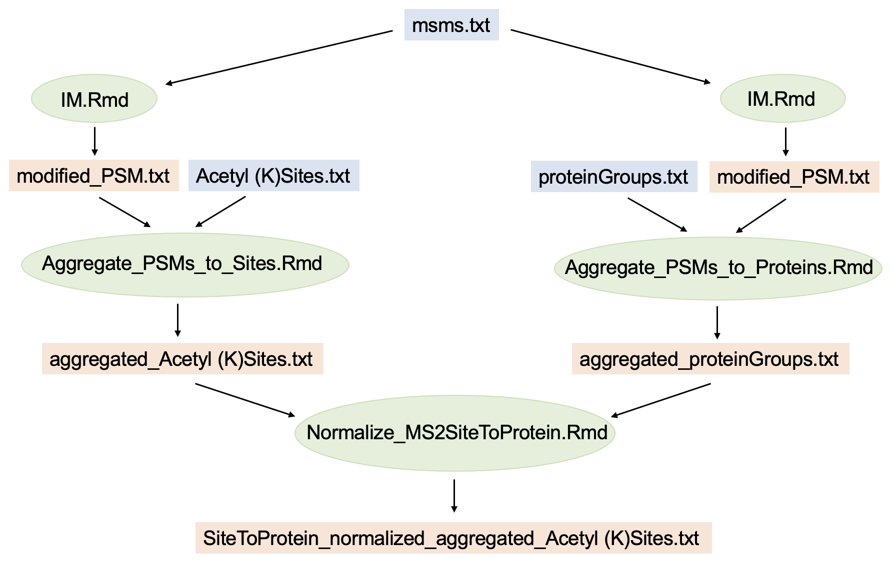
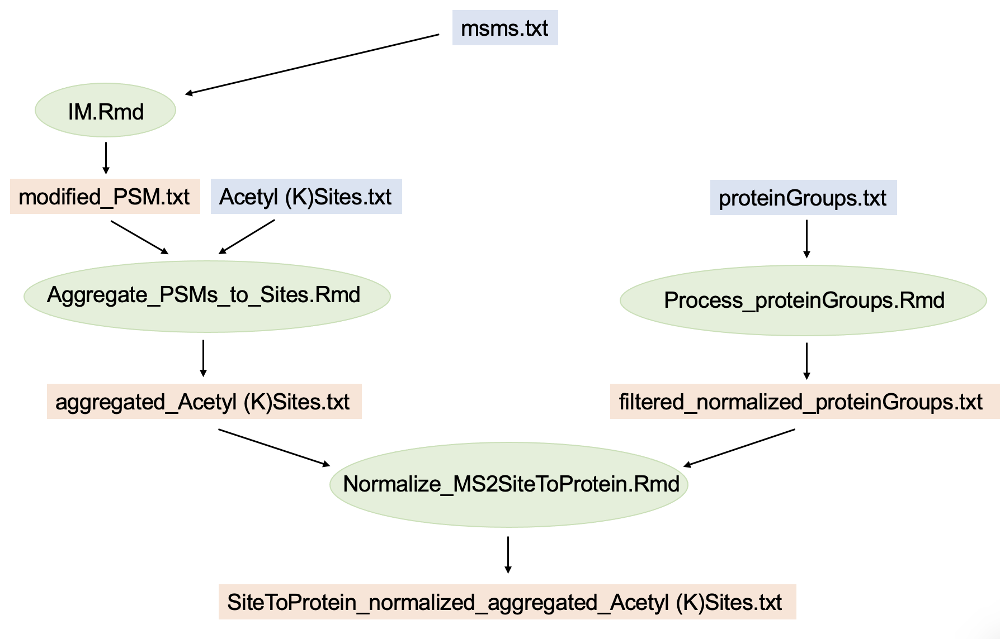

# SiteToProteinNormalization_in_MultiplexProteomics
An R implementation for site-to-protein normalization in MS2-based multiplex proteomics. By accounting for reporter ion interference, the workflow mitigates bias in protein-normalized site relative abundances arising from ratio compression effects. Currently supports MaxQuant output only. 


## Dependencies
This workflow builds on the methodology and computational tools of [interference modeling](https://github.com/moritzmadern/InterferenceModeling_in_MultiplexProteomics) in MS2-based multiplex proteomics.


## Contents:

- **Normalize_MS2SiteToProtein.Rmd** : R markdown script that performs the final step of the workflow: The normalization of PTM site abundances quantified via MS2-based quantification to underlying protein (i.e. unmodified peptides) abundances, quantified via a) MS2-based or b) MS3-based quantification. Reqires specific site and protein table input (e.g. feature-wise Estimated Interfernce Level (EIL) values, and more), hence the scripts below.

- **functions_Site_To_Protein.R** : Functions required in Normalize_MS2SiteToProtein.Rmd script.

- **Aggregate_PSMs_to_Sites.Rmd** : R markdown script that performs aggregation of PSMs to sites as listed in MaxQuant's site table (e.g. "Acetyl (K)Sites.txt"). The PSM table requires feature-wise Estimated Interference Level (EIL) values as well as between-sample normalized reporter ion intensities. See [interference modeling](https://github.com/moritzmadern/InterferenceModeling_in_MultiplexProteomics) workflow for details.

- **Aggregate_PSMs_to_Proteins.Rmd** : R markdown script that performs aggregation of PSMs to proteins as listed in MaxQuant's protein table ("proteinGroups.txt"). The PSM table requires feature-wise Estimated Interference Level (EIL) values as well as between-sample normalized reporter ion intensities. See [interference modeling](https://github.com/moritzmadern/InterferenceModeling_in_MultiplexProteomics) workflow for details.

- **Process_proteinGroups.Rmd** : R markdown script that performs isotopic impurity correction, between-sample normalization etc. of proteins listed in MaxQuant's protein table ("proteinGroups.txt").

- **Demo** : A folder containing a demo dataset + userguide. Check out Userguide.pdf contained in this folder for detailed instructions and explanations on the demo and the workflow in general. This demo continues the demo of [interference modeling](https://github.com/moritzmadern/InterferenceModeling_in_MultiplexProteomics).


## Data Input [using MS2-quantified Poteins]

- A modified PSM table **modified_PSM.txt**, the result table of [interference modeling](https://github.com/moritzmadern/InterferenceModeling_in_MultiplexProteomics) containing PSM level data of PTM-enriched measurements. By extension, the necessary input for the interference modeling workflow is required (e.g. Thermo raw files, MaxQuant's **msms.txt**, and more).

- A MaxQuant site table, e.g. **Acetyl (K)Sites.txt**.

- Another modified PSM table **modified_PSM.txt**, the result table of [interference modeling](https://github.com/moritzmadern/InterferenceModeling_in_MultiplexProteomics) containing PSM level data of unmodified peptide (i.e. "proteome") measurements. By extension, the necessary input for the interference modeling workflow is required (e.g. Thermo raw files, MaxQuant's **msms.txt**, and more).

- A MaxQuant protein table **proteinGroups.txt**.

Note that all Thermo raw files of the experiment need to be searched together in a single MaxQuant database search. This will generate ID columns in the MaxQuant output tables (PSM table, protein table, site table) that reference each other, which is essential to this workflow. An example of the entire workflow for quantified acetyl sites is summarized by this graph:



In blue: MaxQuant search engine output; in green: R-scripts; in orange: intermediate or final data output.


## Data Input [using MS3-quantified Poteins]

- A modified PSM table **modified_PSM.txt**, the result table of [interference modeling](https://github.com/moritzmadern/InterferenceModeling_in_MultiplexProteomics) containing PSM level data of PTM-enriched measurements. By extension, the necessary input for the interference modeling workflow is required (e.g. Thermo raw files, MaxQuant's **msms.txt**, and more).

- A MaxQuant site table, e.g. **Acetyl (K)Sites.txt**.

- A MaxQuant protein table **proteinGroups.txt** containing reporter ion intensities of proteins quantified via MS3-based quantification.

- Optional: An isotopic impurity matrix for isotopic impurity correction of MS3-quantified protein intensities in proteinGroups.txt (unless performed by search engine).

Note that all Thermo raw files of the experiment need to be searched together in a single MaxQuant database search. This will generate ID columns in the MaxQuant output tables (PSM table, protein table, site table) that reference each other, which is essential to this workflow. An example of the entire workflow for quantified acetyl sites is summarized by this graph:



In blue: MaxQuant search engine output; in green: R-scripts; in orange: intermediate or final data output.


## Data Output:

In both cases (i.e. normalization to either MS2-quantified proteins, or MS3-quantified proteins), the output comprises:

- A **modified MaxQuant site table**, filtered for sites that could be normalized to corresponding protein level (i.e. unmodified peptides of the same proteins). Contains multiple intensity columns, which are already normalized between samples. These are: 
Site intensities (no suffix), interference-adjusted site intensities (suffix `__IFadjust`), underlying protein intensities (suffix `__underlyingProtein`), interference-adjusted underlying protein intensities (suffix `__underlyingProtein_IFadjust`),
site-to-protein normalized abundances that are likely biased by varying degrees of ratio compression in individual site and protein pairs (suffix `__siteToProtein`), and finally interference-adjusted site-to-protein normalized abundances that mitigate this aforementioned bias (suffix `__siteToProtein_IFadjust`).
If a batch vector was specified in the parameter section of **Normalize_MS2SiteToProtein.Rmd**, the output table contains additional columns for all intensity types that are batch corrected via the comBat algorithm (additional suffix `__batchCorr`). Further, the table contains ANOVA p-values and other metrics of interest. 

- various **intermediate output tables** which serve as input for **Normalize_MS2SiteToProtein.Rmd**.


## Session Info

```
R version 4.1.2 (2021-11-01)
Platform: x86_64-apple-darwin17.0 (64-bit)
Running under: macOS Mojave 10.14.6

Matrix products: default
BLAS:   /System/Library/Frameworks/Accelerate.framework/Versions/A/Frameworks/vecLib.framework/Versions/A/libBLAS.dylib
LAPACK: /Library/Frameworks/R.framework/Versions/4.1/Resources/lib/libRlapack.dylib

locale:
[1] en_US.UTF-8/en_US.UTF-8/en_US.UTF-8/C/en_US.UTF-8/en_US.UTF-8

attached base packages:
[1] stats4    stats     graphics  grDevices utils     datasets  methods   base     

other attached packages:
 [1] dendextend_1.15.2           MSnbase_2.20.0              ProtGenerics_1.26.0         mzR_2.28.0                  Rcpp_1.0.7                  DESeq2_1.34.0              
 [7] SummarizedExperiment_1.24.0 Biobase_2.54.0              MatrixGenerics_1.6.0        matrixStats_0.61.0          GenomicRanges_1.46.1        GenomeInfoDb_1.30.0        
[13] IRanges_2.28.0              S4Vectors_0.32.3            BiocGenerics_0.40.0         gridExtra_2.3               cowplot_1.1.1               limma_3.50.0               
[19] sva_3.42.0                  BiocParallel_1.28.3         genefilter_1.76.0           mgcv_1.8-38                 nlme_3.1-153                gplots_3.1.1               
[25] plotly_4.10.0               RColorBrewer_1.1-3          reshape2_1.4.4              MASS_7.3-54                 pals_1.7                    forcats_0.5.1              
[31] stringr_1.4.0               dplyr_1.0.7                 purrr_0.3.4                 readr_2.1.1                 tidyr_1.1.4                 tibble_3.1.6               
[37] ggplot2_3.3.6               tidyverse_1.3.1    
```


